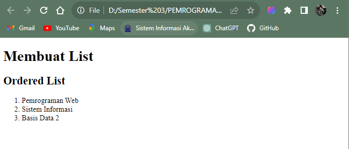
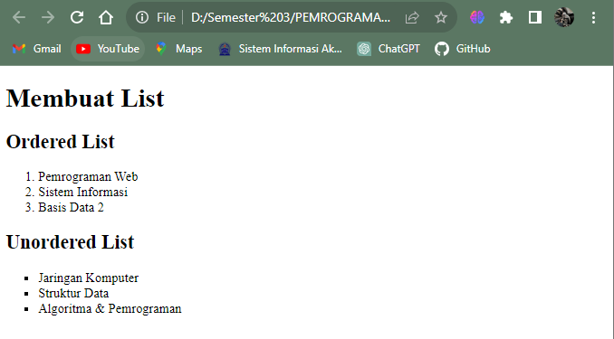
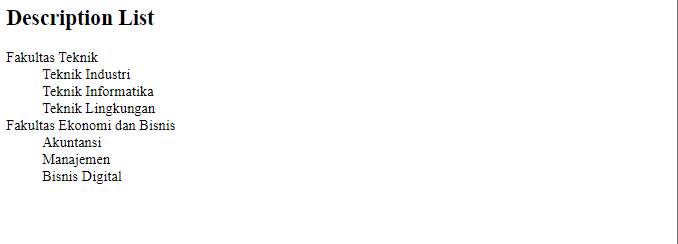
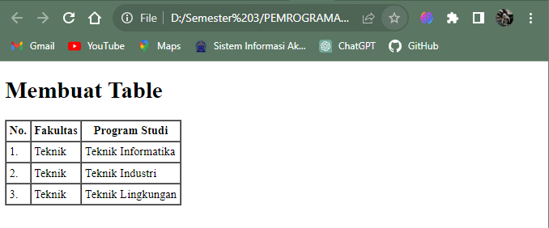
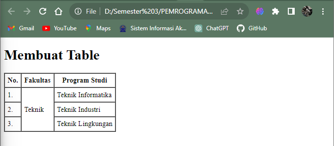
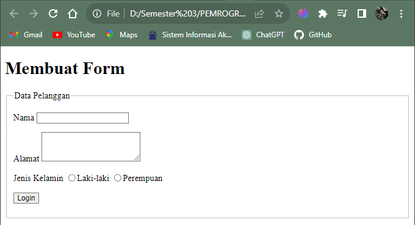
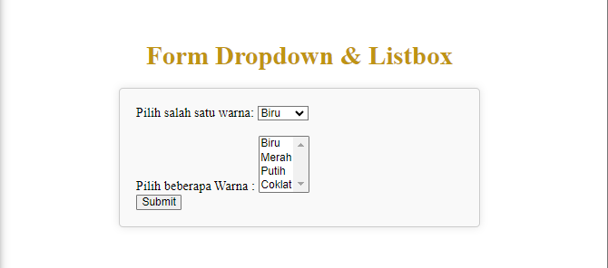

# **Lab 3 Web**

```
Nama    : Nurul Akbar
NIM     : 312210413
Kelas   : TI.2.A.4
```

## **Instruksi Praktikum**

1. Persiapkan text editor VSCode.
2. Buat folder baru dengan nama Lab3Web
3. Ikuti langkah-langkah praktikum yang akan dijelaskan berikutnya.
4. Lakukan validasi dokumen html dengan mengakses http://validator.w3.org

## **Langkah-langkah Praktikum**

- Membuat dokumen HTML dengan nama file lab3_list.html

```html
<!DOCTYPE html>
<html lang="en">
  <head>
    <meta charset="UTF-8" />
    <meta name="viewport" content="width=device-width, initial-scale=1.0" />
    <title>HTML Lanjutan</title>
  </head>
  <body>
    <header>
      <h1>Membuat List</h1>
    </header>
  </body>
</html>
```

- Membuat Ordered List

```html
<section id="order-list">
  <h2>Ordered List</h2>
  <ol>
    <li>Pemrograman Web</li>
    <li>Sistem Informasi</li>
    <li>Basis Data 2</li>
  </ol>
</section>
```



- Membuat Unorderd List

```html
<section id="unorder-list">
  <h2>Unordered List</h2>
  <ul type="square">
    <li>Jaringan Komputer</li>
    <li>Struktur Data</li>
    <li>Algoritma &amp; Pemrograman</li>
  </ul>
</section>
```



- Membuat Description List

```html
<section id="unorder-list">
  <h2>Description List</h2>
  <dl>
    <dt>Fakultas Teknik</dt>
    <dd>Teknik Industri</dd>
    <dd>Teknik Informatika</dd>
    <dd>Teknik Lingkungan</dd>
    <dt>Fakultas Ekonomi dan Bisnis</dt>
    <dd>Akuntansi</dd>
    <dd>Manajemen</dd>
    <dd>Bisnis Digital</dd>
  </dl>
</section>
```



- Membuat Tabel (file baru dengan nama lab3_tabel.html)

```html
<!DOCTYPE html>
<html lang="en">
  <head>
    <meta charset="UTF-8" />
    <meta name="viewport" content="width=device-width, initial-scale=1.0" />
    <title>HTML Lanjutan</title>
  </head>
  <body>
    <header>
      <h1>Membuat Table</h1>
    </header>
  </body>
</html>
```

- tambahkan kode untuk membuat tabel sederhana

```html
<table border="1" cellpadding="4" cellspacing="0">
  <thead>
    <tr>
      <th>No.</th>
      <th>Fakultas</th>
      <th>Program Studi</th>
    </tr>
  </thead>
  <tbody>
    <tr>
      <td>1.</td>
      <td>Teknik</td>
      <td>Teknik Informatika</td>
    </tr>
    <tr>
      <td>2.</td>
      <td>Teknik</td>
      <td>Teknik Industri</td>
    </tr>
    <tr>
      <td>3.</td>
      <td>Teknik</td>
      <td>Teknik Lingkungan</td>
    </tr>
  </tbody>
</table>
```



- Mengatur Margin dan Padding

```html
<table border="1" cellpadding="4" cellspacing="0"></table>
```

- Menggabungkan Sel Data

```html
<table border="1" cellpadding="6" cellspacing="0">
  <thead>
    <tr>
      <th>No.</th>
      <th>Fakultas</th>
      <th>Program Studi</th>
    </tr>
  </thead>
  <tbody>
    <tr>
      <td>1.</td>
      <td rowspan="3">Teknik</td>
      <td>Teknik Informatika</td>
    </tr>
    <tr>
      <td>2.</td>
      <td>Teknik Industri</td>
    </tr>
    <tr>
      <td>3.</td>
      <td>Teknik Lingkungan</td>
    </tr>
  </tbody>
</table>
```



- Membuat Form (Buat file baru dengan nama lab3_form.html)

```html
<!DOCTYPE html>
<html lang="en">
  <head>
    <meta charset="UTF-8" />
    <meta name="viewport" content="width=device-width, initial-scale=1.0" />
    <title>HTML Lanjutan</title>
  </head>
  <body>
    <header>
      <h1>Membuat Form</h1>
    </header>
  </body>
</html>
```

- selanjutnya tambahkan kode untuk membuat tabel sederhana

```html
<form action="proses.php" method="post">
  <fieldset>
    <legend>Data Pelanggan</legend>
    <p>
      <label for="nama">Nama</label>
      <input type="text" id="nama" name="nama" />
    </p>
    <p>
      <label for="alamat">Alamat</label>
      <textarea id="alamat" name="alamat" cols="20" rows="3"></textarea>
    </p>
    <p>
      <label>Jenis Kelamin</label>
      <input id="jk_l" type="radio" name="kelamin" value="L" /><label for="jk_l"
        >Laki-laki</label
      >
      <input id="jk_p" type="radio" name="kelamin" value="P" /><label for="jk_p"
        >Perempuan</label
      >
    </p>
    <p><input type="submit" value="Login" /></p>
  </fieldset>
</form>
```



- Menabahkan Style pada Form

```html
<style>
  form p > label {
    display: inline-block;
    width: 100px;
  }
  form input[type="text"],
  form textarea {
    border: 1px solid #197a43;
  }
  form input[type="submit"] {
    border: 1px solid #197a43;
    background-color: #197a43;
    color: #ffffff;
    font-weight: bold;
    padding: 5px 15px;
  }
</style>
```

## *Pertanyaan dan Tugas*

1. Buatlah form yang menampilkan dropdown menu dan listbox dengan multiple selection.


